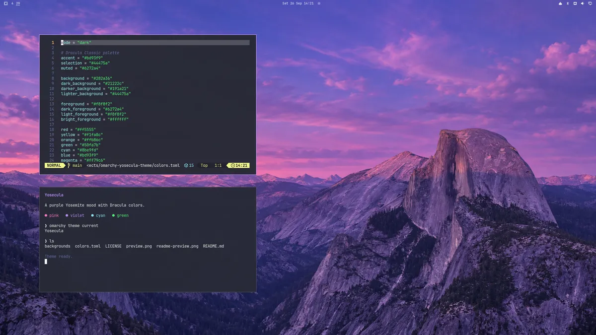

# Yosecula

Yosecula is a dark [Omarchy](https://omarchy.org/) theme with a palette inspired by [Dracula](https://draculatheme.com/) and a purple Yosemite-inspired wallpaper. Its name pairs Yosemite with Dracula.

## Previews

### Wallpaper and palette

[](preview.png)

The Dracula mascot and color swatches sit in the lower-left corner, leaving the purple sky and Half Dome visible. [Open the full-size preview](preview.png).

### Desktop screenshot

[](desktop-screenshot.webp)

This desktop screenshot was submitted with the Omarchy themes listing pull request.

## Install

```bash
omarchy theme install https://github.com/codereport/omarchy-yosecula-theme
```

Then select **Yosecula** from Omarchy's theme menu, or run:

```bash
omarchy theme set yosecula
```

To install the matching Matrix rain screensaver, run:

```bash
python3 "$HOME/.config/omarchy/themes/yosecula/screensaver.py"
```

[post-omarchy-install](https://github.com/codereport/post-omarchy-install) runs this installer automatically as part of Essential. The theme owns the launchers, artwork, idle service, menu action, dependency installation, and a `theme-set` hook that refreshes them when Yosecula is selected again. Changed files are backed up under `~/.local/state/yosecula/backups/`. Audit without applying changes with `screensaver.py --check`; add `--json` for machine-readable state and diffs.

The screensaver runs in Foot with software rendering at 60 FPS, reducing GPU pressure on multiple monitors. It starts after 10 idle minutes and locks after 20; playing VLC inhibits both timers. Existing bar, presentation widgets, and other shell settings are preserved. After installation, Matrix remains the configured screensaver when you switch themes.

## Contents

- `colors.toml` defines the theme's dark palette.
- `matrix.json` defines the rain gradient, bright tips, and final text gradient using six-digit RGB hex colors. The blue, violet, and pink rain colors were sampled from the wallpaper's sky.
- `screensaver.py` installs and audits the screensaver integration in `screensaver/`.
- `backgrounds/` contains the wallpaper used by the theme.
- `preview.png` shows the wallpaper, Dracula mascot, and color palette and appears in Omarchy's theme selector.
- `desktop-screenshot.webp` shows Yosecula on a real desktop and was submitted for the Omarchy themes site.

## Matrix colors

The launcher reads `~/.local/state/omarchy/current/theme/matrix.json` at the start of each animation cycle. Omarchy copies this file from the selected theme, so changing themes changes the palette without editing the launcher. Other themes can provide the same three fields (`rain_color_gradient`, `highlight_color`, and `final_gradient_stops`); missing or invalid palettes use Matrix's green defaults. Edit the theme's `matrix.json` and select the theme again to apply new colors.

## Credits

The color palette is inspired by the Dracula color scheme. The Dracula mascot in the preview belongs to [Dracula Theme](https://draculatheme.com/). The wallpaper was created for this theme from [Hu Nhu's Half Dome photograph](https://commons.wikimedia.org/wiki/File:Glacier_Point_View_of_Half_Dome_at_Sunset_at_Yosemite_National_Park.jpg), which the photographer released under CC0. This repository is an independent community theme for Omarchy.

The Matrix launchers and idle service derive from Omarchy; their MIT licenses are included in `screensaver/matrix/` and `screensaver/cph.idle/`. The theme is available under the [MIT license](LICENSE).
